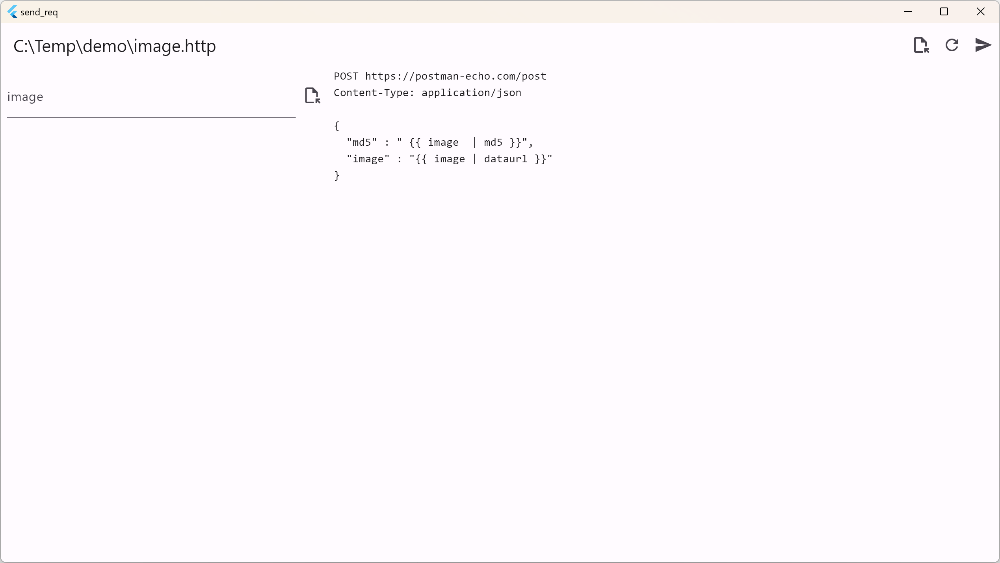
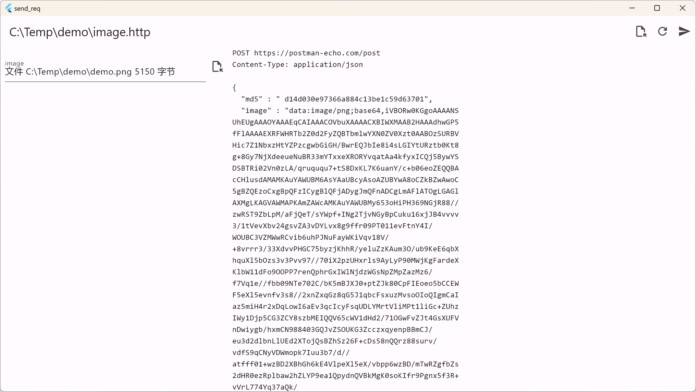
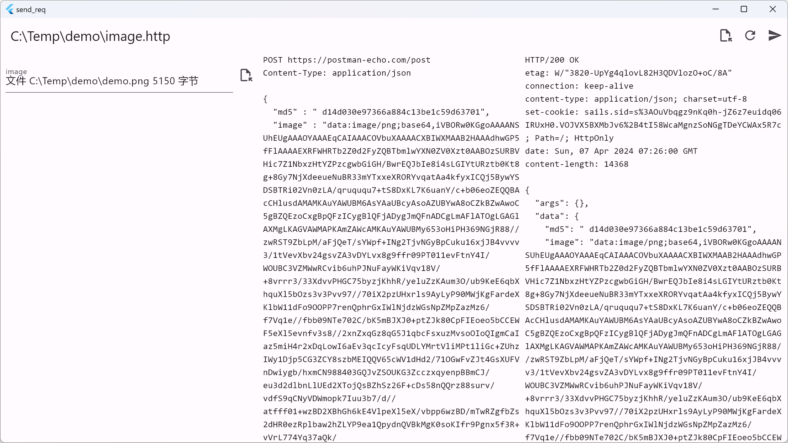

# send_req

a GUI tool to execute .http file

## Getting Started

Usually, we use the .http file to test the API or other complex HTTP request. It's more convenient when change the request parameters than using curl.

There are many other tools to do api test, like postman, insomnia, etc. But these tools are foucs on sending/receiving HTTP request/response, they are not good at building the request body.

For example, if you want post a image with md5 checksum, you need to do these with external tools, like md5sum, or write a script to calculate the md5 checksum.

In `send_req`, you can do these in the .http file directly.

Just like this:

```http
POST http://localhost:8080/upload
Content-Type: application/json

{
  "image" : "{{ image | dataurl }}",
  "md5" : " {{ image  | md5 }}"
}
```

in this example, when you select a image file in the GUI, the `{{ image | dataurl }}` will be replaced with the base64 encoded image data, and the `{{ image | md5 }}` will be replaced with the md5 checksum of the image.

## 1. Open .http file



## 2. Select a image file



## 3. Post the request


